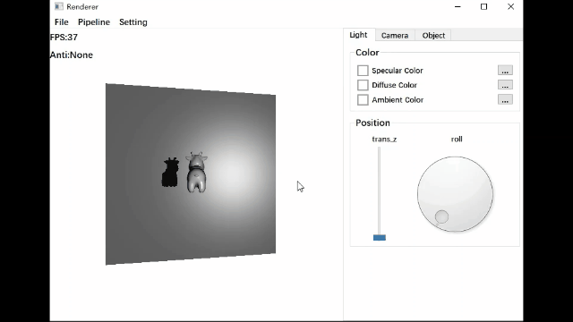
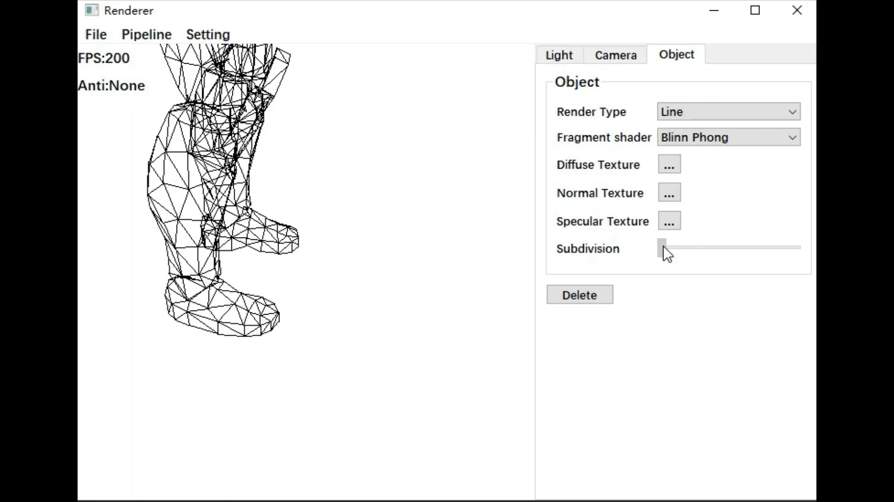
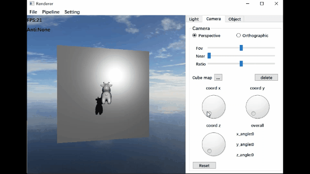
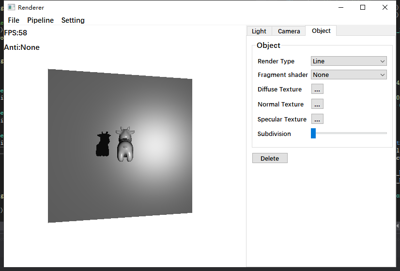
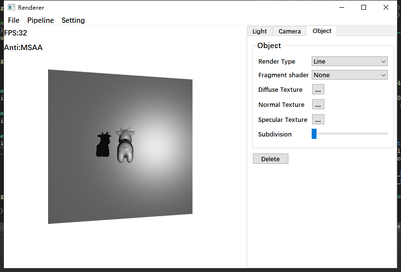
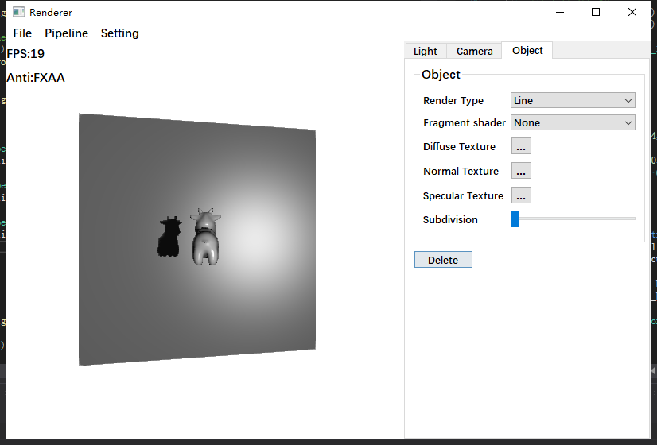

# SRasRenderer

A SoftRas Renderer based on CPU without third party besides Qt as Ui

## Features

### Load Module

* Model(only .obj)
* Texture including diffuse, normal and specular
* Cubemapped Skybox

### Render Pipeline

#### Vertex Shader

* MVP Matrix
* TBN Matrix
* Transformation of Normal(Model Space->View Space)

#### Fragment Shader

* Blinn-Phong reflection model

#### Tessellation Shader

* Phong tessellation

#### Culling

* View Frustum Culling
* Viewport Culling(Sutherland-Hodgman)
* Back-face Culling

#### Rasteration

* Early-z
* Perspective correct interpolation
* Texture mapping

#### Anti-aliasing

* Oversampling including SSAA and MSAA
* Post Processing including FXAA

#### Shadow
* Screen space shadowmap

#### Others
* Bresenham's line algorithm
* Loop Subivison
* Multithread acceleration
* Many interactive features

## Display

### Shadow

### Tessellation

### Skybox

### Anti-aliasing

 
 

> More details can be found in this video(https://www.bilibili.com/video/BV1yV4y1o74Z/?spm_id_from=333.999.0.0&vd_source=ec940e3d5e3d806957bf612f56681ee5)
## Third Party

* Qt5.15.2 as GUI
